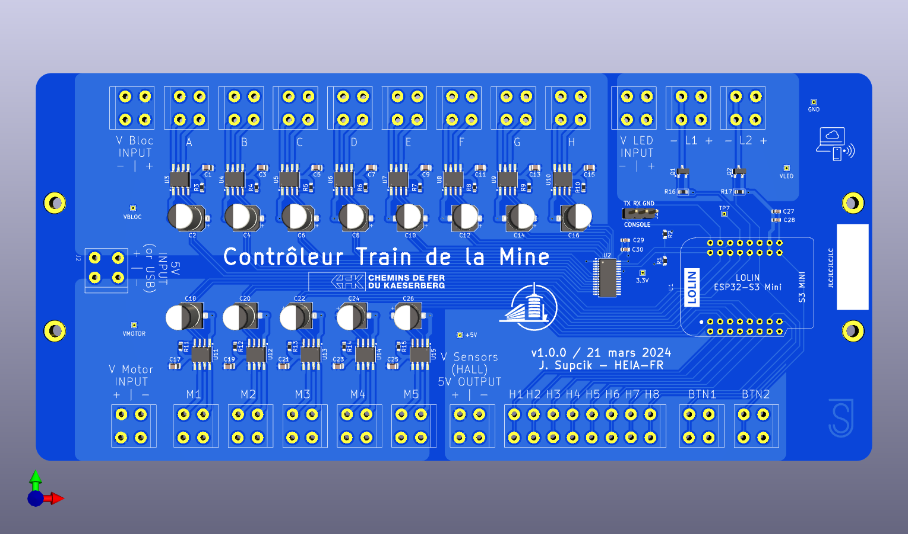

# Le Train de la Mine - PCB

## Illustrations

 

## Schéma

[Schéma électronique](train-de-mine-schematic.pdf)

## Commande de matériel

- [1 x 8p (1 x 12 pièces)](https://fr.aliexpress.com/item/1005005946834644.html)
- [3 x 2p (3 x 50 pièces)](https://fr.aliexpress.com/item/1005005946834644.html)
- [5x jeu de montage DRG-02](https://fr.aliexpress.com/item/32824633947.html)
- [5x rail DIN 30cm](https://fr.aliexpress.com/item/4001298414947.html)
- [5x ESP32-S3 Mini](https://fr.aliexpress.com/item/1005005449219195.html)
- [1x Connecteur femelle à 2x8 broches (50 pièces)](https://fr.aliexpress.com/item/32604411845.html)

